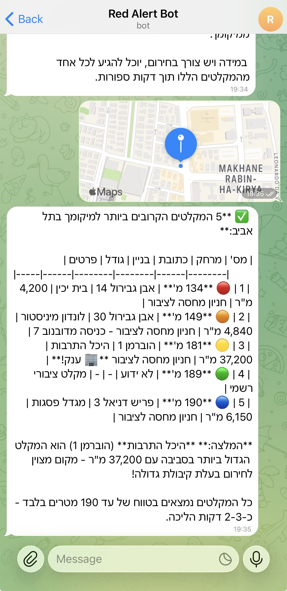
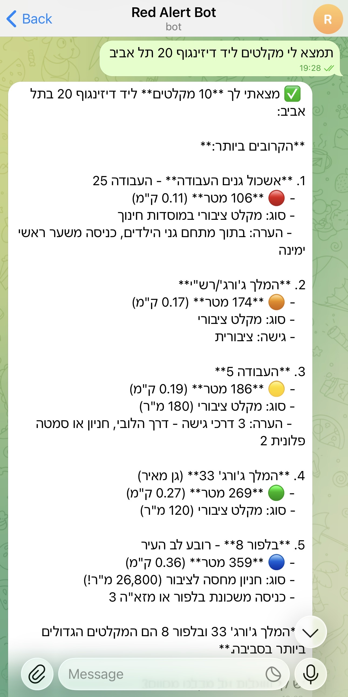
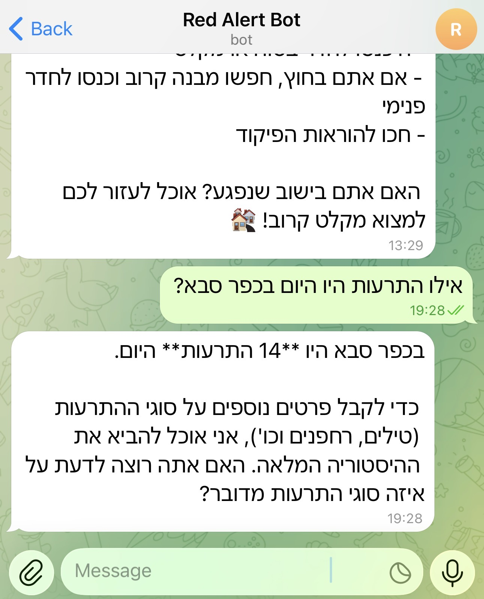

# RedAlert Telegram Bot

A Telegram bot for Israel's RedAlert emergency alert system, powered by Claude AI and the [redalert-mcp-server](https://github.com/ozba/redalert-mcp-server).

The bot spawns the RedAlert MCP server as a child process, uses Claude API (Sonnet) for natural language understanding, and lets users query alerts, find shelters, and get statistics - all through natural conversation in Hebrew or English.

## Features

- **Natural language queries** - ask about alerts, shelters, statistics in Hebrew or English
- **Real-time alert data** via MCP server connection to RedAlert API
- **Shelter search** - find nearby shelters by city name or location
- **Alert statistics** - historical data, city comparisons, distribution analysis
- **Per-user conversations** with sliding window history
- **Rate limiting** - 5/min, 30/hr, 100/day per user
- **MCP crash recovery** - automatic restart with exponential backoff

## Architecture

```
User (Telegram) → Telegraf Bot → Claude API (Sonnet) → MCP Client → redalert-mcp-server → RedAlert API
```

The bot uses an agentic loop: Claude decides which tools to call, the bot executes them via MCP, and results flow back to Claude for a natural language response.

## Setup

### Prerequisites

- Node.js 22+
- Telegram bot token (from [@BotFather](https://t.me/BotFather))
- Anthropic API key
- RedAlert API key (from [redalert.orielhaim.com](https://redalert.orielhaim.com))

### Install & Run

```bash
npm install
npm run build
```

Create a `.env` file (see `.env.example`):

```
TELEGRAM_BOT_TOKEN=your-telegram-token
ANTHROPIC_API_KEY=your-anthropic-key
REDALERT_API_KEY=your-redalert-key
```

```bash
npm start
```

### Development

```bash
npm run dev  # watch mode with .env auto-loaded
```

### Docker

```bash
npm run docker:build
npm run docker:run
```

## Bot Commands

| Command | Description |
|---------|-------------|
| `/start` | Welcome message |
| `/help` | List capabilities and example queries |
| `/status` | Bot health, MCP connection, uptime |
| `/alerts` | Quick shortcut for active alerts |
| `/shelters <city>` | Find shelters near a city |
| `/clear` | Reset conversation history |

## Examples

### Missile Alerts Query
> "פרט לי את כל ההתראות טילים שהיו היום באילת"



### Shelter Search by Location
Share your GPS location and the bot finds the 5 nearest shelters with addresses, distances, and capacity.



### Shelter Search by Address
> "תמצא לי מקלטים ליד דיזינגוף 20 תל אביב"



### More Example Queries

- "Are there active alerts right now?"
- "תראה לי את כל ההתראות בכפר סבא בשבוע האחרון"
- "Find shelters near Habima Theatre"
- "Compare missile alerts between Kfar Saba and Shoham"
- "מה הסטטיסטיקות של התראות טילים מעזה?"

## Testing

```bash
npm test          # 57 tests across 5 files
npm run test:watch  # watch mode
```

## Environment Variables

| Variable | Required | Description |
|----------|----------|-------------|
| `TELEGRAM_BOT_TOKEN` | Yes | From @BotFather |
| `ANTHROPIC_API_KEY` | Yes | Claude API key |
| `REDALERT_API_KEY` | Yes | RedAlert API key |
| `NODE_ENV` | No | `production` / `development` |
| `LOG_LEVEL` | No | `debug` / `info` / `warn` / `error` |
| `BOT_ADMIN_CHAT_ID` | No | Telegram chat ID for admin alerts |

## License

MIT
